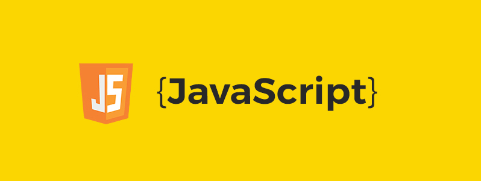
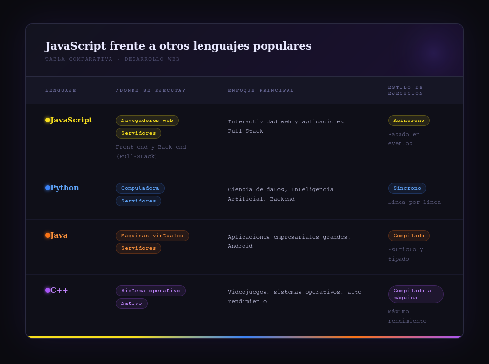
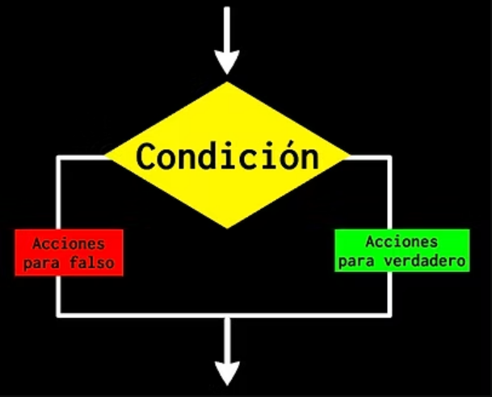
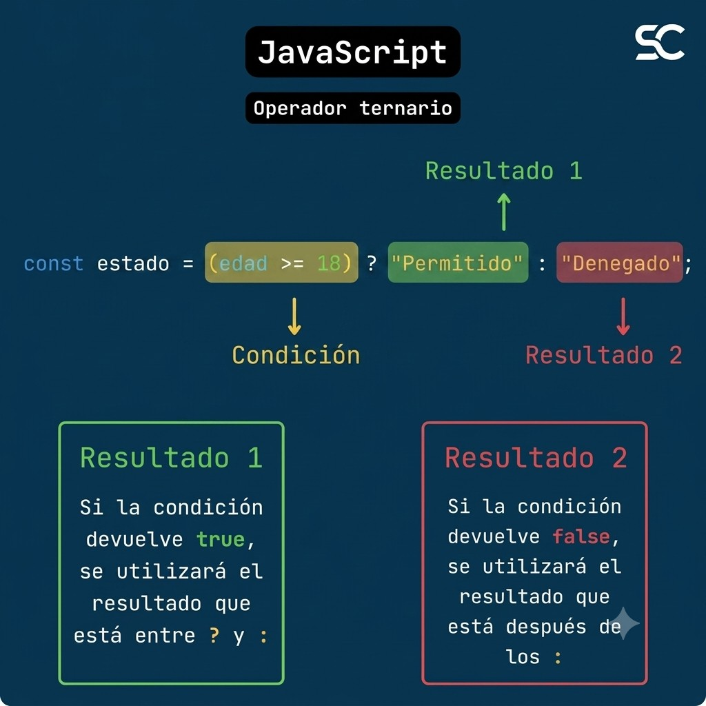
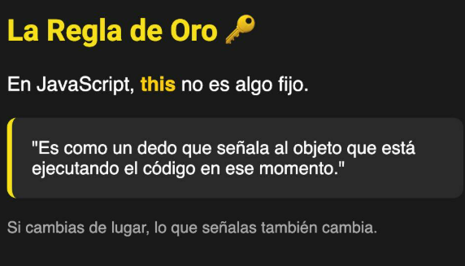
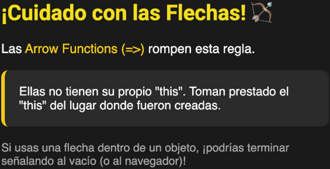

# Fundamentos de JavaScript

**Temario:**

📋Introducción a JavaScript

📋¿Qué diferencia a JavaScript de otros lenguajes de programación?

📋Tipos de datos en JS

📋¿Cuáles son las tres funciones de String en JS?

📋¿Qué es un condicional?

📋¿Qué es un operador ternario?

📋Declaración de función vs  Expresión de función.

📋¿Qué es la palabra clave "this" en JS?

<figure><figcaption></figcaption></figure>

&#x20;

## Introducción

JavaScript es un lenguaje de programación multiplataforma orientado a objetos que se utiliza para hacer que las páginas web sean interactivas (ej., Que tienen animaciones complejas, botones en los que se puede hacer clic, menús emergentes, etc.).

💡Si pensamos en una página web como un coche, el HTML es el chasis y la estructura mecánica, el CSS es la carrocería y la pintura, y JavaScript es el motor — lo que hace que todo se mueva y funcione.

#### ¿Para qué sirve? (Su rol en la web)

Originalmente nació para hacer pequeños trucos en las páginas (como efectos de luces en los botones o validar formularios), pero hoy en día es un lenguaje monstruosamente potente que sirve para:

* **Crear interactividad en el navegador:** Animaciones, menús desplegables, galerías de fotos, mapas interactivos (como Google Maps) o actualizaciones de contenido en tiempo real sin tener que recargar toda la página (como cuando te llega un mensaje en una red social).
* **Desarrollo Frontend moderno:** Es la base de las aplicaciones web que usas a diario. Herramientas y frameworks como React, Vue o Angular permiten estructurar aplicaciones complejas (como Netflix, Spotify o Twitter) usando JavaScript de fondo.
* **Controlar el DOM (Document Object Model):** JavaScript puede leer, modificar, agregar o eliminar cualquier elemento de HTML y CSS sobre la marcha, respondiendo a lo que hace el usuario (hacer clic, escribir, hacer scroll).

#### Tres características clave de JavaScript

1. Es un lenguaje interpretado y orientado a objetos: No necesitas compilarlo (transformarlo a código binario antes de ejecutarlo). El propio navegador web (Chrome, Firefox, Edge) lee el código directamente y lo ejecuta línea por línea.
2. Basado en eventos: Gran parte de JavaScript se ejecuta cuando "algo pasa". Un evento puede ser que el usuario hizo un _click_, movió el ratón, presionó una tecla o terminó de cargar la página.
3. Es el estándar de la web: Es el único lenguaje de programación que todos los navegadores web del mundo entienden de forma nativa. No necesitas instalar nada en tu computadora para empezar a programar en JS; con un editor de texto y tu navegador ya tienes todo.

#### Un ejemplo básico de código:

Imagínate que quieres que aparezca un mensaje de alerta en la pantalla cuando alguien presione un botón. El código se vería algo así:

```javascript

// Definimos una función (una receta de pasos a seguir)
function saludarUsuario() {
    alert("¡Hola! Bienvenida al mundo de JavaScript.");
}

```

#### ¿Cómo se usa JavaScript en una página web?

JavaScript se puede escribir directamente dentro del archivo HTML usando la etiqueta `<script>`, o en un archivo separado con extensión `.js` que luego se enlaza al HTML.

**Directamente en el HTML:**

```html

<script>
  alert("¡Hola mundo!");
</script>

```

**En un archivo externo:**

```html

<script src = "mi-script.js"></script>

```

Lo más recomendado es usar un archivo externo para mantener el código organizado.<br>

***

## ¿Qué diferencia a JavaScript de otros lenguajes de programación?

JavaScript ocupa un lugar único en el mundo de la programación. Aunque comparte conceptos lógicos con lenguajes como Python, Java o C++, tiene características que lo diferencian radicalmente de cualquier otro.

Las principales diferencias que hacen único a JavaScript son:

#### 1. 👑 El rey absoluto del navegador (Monopolio Frontend)

Esta es su mayor diferencia: JavaScript es el único lenguaje de programación que todos los navegadores web (Chrome, Safari, Firefox, Edge) entienden de forma nativa.&#x20;

* Si quieres programar en Python, el usuario tiene que instalar Python en su computadora.
* Si programas en Java, se necesita una máquina virtual.
* Con JavaScript, el motor para ejecutar el código ya viene integrado en el navegador de cualquier celular, computadora o tablet del mundo. No hay competencia en este terreno.

#### 2. 🌍 El lenguaje que está en todos lados (Full-Stack)

Históricamente, los lenguajes se dividían estrictamente: unos servían para el diseño visual (Frontend) y otros para los servidores y bases de datos (Backend). JavaScript rompió esa barrera. Gracias al nacimiento de Node.js, hoy en día un programador puede usar el mismo y único lenguaje para crear la interfaz visual de una página web, programar el servidor, crear una aplicación móvil (con React Native) y gestionar bases de datos.

#### 3. 📐⚒️ Su arquitectura basada en eventos y asincronía

A diferencia de lenguajes tradicionales donde el código se ejecuta estrictamente de arriba a abajo bloqueando la pantalla hasta que termina una tarea, JavaScript fue diseñado para no quedarse "congelado".

Funciona mediante un bucle de eventos (_Event Loop_):

* El usuario puede hacer clic en un botón para descargar un archivo pesado.
* En lugar de congelar la página web mientras se descarga, JavaScript delega esa tarea en el fondo (_asincronía_) y permite que el usuario siga haciendo scroll o interactuando con otros botones de la página. Cuando la descarga termina, JavaScript avisa y muestra el resultado.

#### 4. ✏️ Tipado dinámico y débil (Flexibilidad extrema)

En lenguajes como C++ o Java (tipado estricto), tienes que decirle a la computadora exactamente qué tipo de dato va a guardar una variable (un número entero, texto, etc.) y no puedes cambiarlo después.

JavaScript es extremadamente permisivo y "adivina" el tipo de dato sobre la marcha:

```javascript

let dato = "Hola"; // JavaScript sabe que es texto (String)
dato = 2026; // Ahora pasa a ser un número sin lanzar ningún error

```

Esta flexibilidad es genial para programar rápido, aunque en proyectos grandes puede causar dolores de cabeza (por eso hoy en día es tan popular usar TypeScript, que le añade reglas estrictas a JavaScript).

<figure><figcaption></figcaption></figure>

💡 En resumen, mientras que otros lenguajes nacieron para calcular datos o manejar sistemas operativos pesados, **JavaScript** nació para dar vida a la web, y su capacidad de adaptarse lo convirtió en el lenguaje más versátil y demandado de la actualidad.

***

## Tipos de datos en JavaScript

En JavaScript hay 8 tipos de datos fundamentales que se dividen en dos grandes categorías: **Primitivos** (inmutables y guardados por valor) y **De Objeto** (mutables y guardados por referencia).

Se organizan así:&#x20;

#### 1. Tipos de Datos Primitivos

<figure><figcaption></figcaption></figure>

💡Nota: Además de los 5 tipos clásicos, aquí incluimos los tipos modernos `bigInt` y `symbol` para tener la guía completamente actualizada.


* `number`: Representa tanto números enteros como de punto flotante. También incluye valores especiales como `Infinity`, `-Infinity` y `NaN` (Not a Number).

```javascript

let edad = 37;
let precio = 22.50;

```

* `string`: Cadenas de texto. Se pueden definir con comillas simples (`'`), dobles (`"`) o backticks (`` ` ``) para plantillas literales.

```javascript

let nombre = 'Ana';
let saludo = `Hola, ${nombre}`;

```

* `boolean`: Solo puede tener dos valores: `true` (verdadero) o `false` (falso). Se usa para lógica y condicionales.

```javascript

let esMayorDeEdad = true;

```

* `undefined`: Es el valor que se le asigna automáticamente a una variable que ha sido declarada pero aún no tiene un valor asignado.

```javascript

let x; // Su valor es undefined

```

* `null`: Representa la ausencia intencional de cualquier valor. Es un "vacío" programado.

```javascript

let vacio = null;

```

⚠️ Dato curioso: Si haces `typeof null`, JavaScript te dirá que es `"object"`. Esto es un error histórico del lenguaje que no se ha cambiado por temas de compatibilidad.


* `bigint`: Sirve para representar números enteros que son demasiado grandes para el tipo `Number` estándar (mayor o igual a 2^53 - 1 (9,007,199,254,740,991)). Se crean agregando una `n` al final del número.

```javascript

let numeroGigante = 9007199254740991n;

```

* `symbol`: Es un valor único e inmutable que se utiliza a menudo como clave para las propiedades de los objetos, evitando colisiones de nombres.&#x20;

⚠️ Aunque dos symbols tengan la misma descripción, nunca son iguales entre sí.

```javascript

Symbol("id") === Symbol("id") // false

```

#### 2. Tipos de Objeto (Complejos o de Referencia)

<figure><figcaption></figcaption></figure>

💡 Cuando copias un objeto, copias la _referencia_ a su lugar en la memoria, no el _valor real_.


* `object`: La estructura base de JavaScript para almacenar datos en pares clave-valor.

```javascript

let persona = { nombre: "Ailén", edad: 37};

```

* `array`: Técnicamente son objetos especiales ordenados por índices numéricos.

```javascript

let colores = ["rojo", "verde", "azul"];

```

* `function`: En JavaScript, las funciones también son objetos de primera clase, lo que significa que pueden guardarse en variables y pasarse como argumentos.

```javascript

function saludar() { return "Hola"; }

```

* `date`: Representa una fecha y hora específica.

```javascript

let hoy = new Date();

```

* `regexp`: Expresión regular utilizada para buscar patrones de texto.

```javascript

let patron = /\w+/i;

```

***

## Las tres funciones de String en JavaScript

Las tres funciones principales de `String` en JavaScript son **convertir tipos de datos**, **manipular cadenas de texto** y **verificar subcadenas**. A continuación, detallamos las operaciones esenciales:&#x20;

#### 1. ✏️ Conversión de Tipos de Datos

Permite transformar otros tipos de datos (como números, booleanos, etc.) en cadenas de texto. Para esto se utiliza la función global `String()`.

```javascript

String(123);        // "123" (Número a String)
String(true);       // "true" (Booleano a String)
String(null);       // "null" (Null a String)

```

#### 2. ✂️ Manipulación y Modificación de Texto

Agrupa a todos los métodos que nos permiten alterar, recortar o transformar una cadena.&#x20;

⚠️ Es importante recordar que no modifican el texto original, sino que _devuelven uno nuevo_.

* `slice(inicio, fin)` o `substring()`: Extraen una porción específica del texto.
* `replace(buscar, cambiar)`: Reemplaza una parte del texto por otra.
* `toUpperCase()` / `toLowerCase()`: Cambian todo el texto a mayúsculas o minúsculas.

```javascript

let curso = "JavaScript";
console.log(curso.slice(0, 4));   // "Java"
console.log(curso.replace("JavaScript", "JS")); //JS - Recuerda que el original no cambia!
console.log(curso.toUpperCase()); // "JAVASCRIPT"


```

#### 3. 🔎 Búsqueda, Verificación y Validación

Son los métodos encargados de inspeccionar el contenido de una cadena para saber si cumple con ciertas condiciones o para encontrar elementos específicos dentro de ella.

* `includes(subcadena)`: Devuelve `true` o `false` si el texto contiene la palabra buscada.
* `indexOf(carácter)`: Devuelve la posición (índice) donde se encuentra el carácter por primera vez. Si no lo encuentra, devuelve `-1`.

```javascript

let saludo = "Hola, bienvenido a devCamp";

console.log(saludo.includes("devCamp")); // true
console.log(saludo.indexOf("b"));          // 6 (la 'b' de bienvenido)

```

***

## ¿Qué es un condicional?

Un **condicional** en JavaScript es una estructura de control que permite a tu programa **tomar decisiones**. Evalúa una condición (que resulta en verdadero o falso) y ejecuta un bloque de código específico dependiendo del resultado.&#x20;

💡Imagínalo como un cartel en la carretera: _"Si tienes combustible, sigue derecho; si no, entra a la gasolinera"_. El programa evalúa la situación y elige qué bloques de código ejecutar y cuáles ignorar.

<figure><figcaption></figcaption></figure>

Estos condicionales son esenciales para controlar el flujo de ejecución de un programa. Sin ellos, los programas seguirían un camino rígido y predefinido sin poder adaptarse a diferentes situaciones.


<figure><figcaption></figcaption></figure>

#### Tipos de condicionales

Los condicionales en programación vienen en diferentes formas y se adaptan a diversas necesidades. Estos tipos de condicionales permiten a los programadores especificar distintos caminos de ejecución en función de diferentes situaciones.

<figure><figcaption></figcaption></figure>

### 1. El `if` (La condición simple)

El condicional simple evalúa una condición y ejecuta un bloque de código si esta condición es verdadera.

```javascript

let edad = 20;

// "Si edad es mayor o igual a 18..."
if (edad >= 18) {
    console.log("¡Puedes pasar al bar!"); 
}

```

### 2. El `else` (Condicional doble)

Es el camino alternativo obligatorio cuando el primer intento da `false`. El condicional doble evalúa una condición y ejecuta un bloque de código si esta es verdadera, y otro bloque si la condición es falsa.

```javascript

let tieneEntrada = false;

if (tieneEntrada) {
    console.log("¡Bienvenido al show!");
} else {
    console.log("Lo siento, tienes que comprar un ticket primero."); // Se ejecuta este
}

```

### 3. El `else if` (Condicional anidado)

Es como tener varias opciones y elegir la primera que se cumpla. Puedes encadenar tantos `else if` como necesites. JavaScript va a ir preguntando uno por uno de arriba hacia abajo, y en cuanto uno dé `true`, ejecuta ese bloque y se sale.

```javascript

let hora = 14;

if (hora < 12) {
    console.log("¡Buen día!");
} else if (hora < 20) {
    console.log("¡Buenas tardes!"); // Se ejecuta este porque 14 es menor que 20
} else {
    console.log("¡Buenas noches!");
}

```

### 4. El `switch` (Condicional múltiple)

Útil cuando comparas una variable contra muchos valores concretos. Es ideal cuando tienes un abanico de opciones fijas y conocidas (como los días de la semana, los meses o un menú de opciones).

```javascript

let diaDeLaSemana = "Martes";

switch (diaDeLaSemana) {
    case "Lunes": 
        console.log("Hoy se trabaja temprano.");
        break; // <- Detiene la ejecución si fue Lunes
    case "Martes":
        console.log("¡El bar está cerrado por descanso!"); // <- Se ejecuta este bloque
        break;
    case "Sábado":
    case "Domingo": // <- Si es Sábado o Domingo, ejecutan el mismo bloque
        console.log("¡Fin de semana de mucho movimiento!");
        break;
    default: // <- Si no es ninguna de las opciones anteriores (como un else)
        console.log("Día laboral normal.");
}

```

💡 **Nota**: Sin `break`, JavaScript sigue ejecutando los casos siguientes aunque no coincidan.

***

## El operador ternario

El **operador ternario** es una alternativa al condicional **if/else** de una forma mucho más compacta y breve, que en muchos casos resulta más legible.

Se llama "ternario" porque es el único operador en la mayoría de los lenguajes de programación que toma tres argumentos (o partes).

#### Sintaxis y componentes

<figure><figcaption></figcaption></figure>

* Condición: Una expresión que se evalúa como verdadera o falsa (`true` o `false`).
* ? (Signo de interrogación): Separa la condición de las respuestas. Actúa como un _"¿es esto verdadero?"_.
* : (Dos puntos): Separa la acción verdadera de la falsa. Actúa como un _"si no"_.


**Ejemplo comparativo:**&#x20;

```javascript

// Con if...else
let edad = 20;
let mensaje;

if (edad >= 18) {
  mensaje = "Mayor de edad";
} else {
  mensaje = "Menor de edad";
}

// Con operador ternario (equivalente exacto)
let mensajeTernario = edad >= 18 ? "Mayor de edad" : "Menor de edad";

```

#### **¿Cuándo usarlo?**

Ideal para asignaciones simples donde la condición y los dos resultados son cortos. Si la lógica es compleja, conviene quedarse con el `if...else` clásico por legibilidad.

⚠️**Evítalo cuando:** Tengas que anidar múltiples condiciones (ternarios dentro de ternarios). Esto se convierte rápidamente en un "código espagueti" indescifrable. Si necesitas evaluar varias cosas, el `if-else` tradicional o un `switch` siguen siendo los reyes.

***

## Declaración de función vs  Expresión de función.

La diferencia principal radica en cuándo se crea la función y dónde puedes invocarla.&#x20;

#### 1. Declaración de función (Function Declaration)

Se define con `function nombre() {}` al inicio. Una característica clave es el **izamiento** (_hoisting_): la función se carga en memoria antes de leer el código, por lo que puedes llamarla **incluso antes** de haberla escrito en el documento.

```javascript

function saludar(nombre) {
  return `¡Hola, ${nombre}!`;
}

console.log(saludar("Ailén")); // "¡Hola, Ailén!"

```

**Ejemplo de Hoisting:**

```javascript

console.log(despedirse('Ailén')); // Funciona perfectamente: "Adiós Ailén"

function despedirse(nombre) {
  return `Adiós ${nombre}`;
}

```

#### 2. Expresión de función (Function Expression)

La función se crea como parte de una expresión ejecutable, usualmente asignándola a una variable (`const miFuncion = function() {}` ).&#x20;

Estas funciones no permiten ser invocadas antes de su definición, ya que no están completamente disponibles en memoria hasta que el intérprete llega a esa línea de código. Pueden ser anónimas o nombradas.

```javascript

// Expresión de función anónima
const despedir = function(nombre) {
  return `Adiós, ${nombre}`;
};

console.log(despedir("Aitor")); // "Adiós, Aitor"

```

#### 💡 Evolución moderna: Funciones Flecha (Arrow Functions)

Hoy en día, el estándar de la industria para escribir expresiones de función es usar la sintaxis de flecha:

```javascript
const despedirArrow = (nombre) => `Adiós, ${nombre}`;
```

### ⚡ Puntos claves que marcan la diferencia

#### ⚠️ El matiz del Hoisting con `var` vs `let` / `const`

Técnicamente, cuando usas una expresión, la variable sí sufre hoisting, pero su contenido no. Dependiendo de cómo la declares, el error será distinto si intentas llamarla antes de tiempo:

* Con `const` o `let`: Lanza un `ReferenceError` (no se puede acceder antes de su inicialización).
* Con `var`: Lanza un `TypeError: miFuncion is not a function`. Esto pasa porque `var` se eleva como `undefined`, ¡y no puedes ejecutar un `undefined()`!

#### 🔒 No contaminar el "Global Scope"

Al usar expresiones con `const`, proteges tu función de ser sobrescrita accidentalmente. Con las declaraciones tradicionales, si creas dos funciones con el mismo nombre por error, la segunda pisará a la primera sin mostrarte ninguna advertencia.

#### 📦 El "Scope" (Alcance) en bloques de código

Las declaraciones de función dentro de bloques (como un `if` o un `for`) podían comportarse de forma impredecible en navegadores antiguos. Las expresiones de función con `const` respetan estrictamente el alcance del bloque donde fueron creadas, lo que las hace mucho más seguras.

#### 🤔¿Cuál elegir?

* Usa **Expresiones de función (y Arrow Functions) por defecto**: Es el estándar moderno. Al no permitir su uso antes de la definición, te obliga a mantener un código más ordenado (primero defines, luego usas) y evita efectos secundarios inesperados con el hoisting.
* Usa **Declaraciones de función**: Principalmente si estás creando librerías donde quieres que ciertas funciones globales estén disponibles en cualquier parte del documento sin importar el orden de carga, o si prefieres un estilo de lectura _Top-Down_ (de arriba hacia abajo), donde el código principal está arriba y las funciones de soporte abajo.

***

## ¿Qué es la palabra clave "this" en JS?

En términos sencillos `this` es un atajo o una referencia al objeto que está ejecutando una función en un momento determinado.

A diferencia de otros lenguajes de programación donde `this` siempre apunta a la clase actual, en JavaScript su valor no es fijo. Depende enteramente de cómo y dónde se invoca (se llama) la función, no de dónde se escribió,  _(excepto en las arrow functions — \[ver excepción]\(#_&#x61;rrow-function&#x73;_))_"

<figure><figcaption></figcaption></figure>

💡Para entenderlo de forma visual, piensa en `this` como el pronombre "yo". Si un gato dice "yo", se refiere al gato. Si un perro dice "yo", se refiere al perro. El significado cambia según quién hable:


### 🌐La regla base: Las Funciones independientes&#x20;

Antes de ver las reglas avanzadas imagínate que `this` siempre necesita estar dentro de "alguien" (un objeto) para saber quién es. Si creas una función suelta, en el aire, no tiene dueño.

Como JavaScript no puede dejar a `this` vacío, por defecto dice: _"Bueno, como nadie te reclama, tu dueño va a ser el jefe supremo de la pantalla: el objeto `window`_(o el contexto global)"

```javascript
// Está suelta, no está dentro de ningún objeto {}
function mostrarThis() {
  console.log(this); 
}

mostrarThis(); // En el navegador, imprime 'window'
```

⚠️ **¡Ojo!** Si `this` apunta a `window` e intentas buscar `this.nombre`, JavaScript buscará `window.nombre`. Como eso no existe, te devolverá `undefined`.

### Las 4 Reglas para saber a qué apunta `this`

El valor de `this` se define principalmente por estas cuatro situaciones:

#### **1. En un método de objeto** (Invocación implícita)

Cuando llamas a una función que es propiedad de un objeto, `this` apunta al **objeto que está antes del punto**.

```javascript
const usuario = {
  nombre: "Ailén",
  saludar() {
    console.log(`Hola, soy ${this.nombre}`); //'this' apunta a 'usuario'
  }
};
usuario.saludar(); // Imprime: Hola, soy Ailén
```

#### 2. El comportamiento en funciones globales o sueltas (Invocación directa)

Como vimos en la regla base, si llamas a una función normal y suelta su comportamiento dependerá de si usas el modo estricto o no:

* En modo no estricto: `this` apunta al objeto global (`window` en el navegador, `global` en Node.js).
* En modo estricto (`"use strict";`): `this` será `undefined` (lo cual es excelente para evitar errores accidentales).

```javascript
function dondeEstoy() {
  return this;
}
console.log(dondeEstoy()); // Muestra el objeto Window (en navegador)
```

#### 3. En funciones constructoras o Clases (Operador `new`)

Cuando usas la palabra clave `new` para crear una nueva instancia, JavaScript crea un objeto vacío tras bambalinas y hace que `this` apunte al nuevo objeto que se está creando.

```javascript
function Persona(nombre) {
  this.nombre = nombre; // 'this' apunta al nuevo objeto vacío
}
const ailen = new Persona("Ailén");
console.log(ailen.nombre); // "Ailén"
```

#### 4. Invocación explícita (`call`, `apply` y `bind`)

JavaScript te permite forzar el valor de `this` en cualquier función utilizando estos tres métodos tradicionales:

* `call` y `apply`: Ejecutan la función inmediatamente cambiando el contexto de `this` por el objeto que les pases.
* `bind`: No ejecuta la función de inmediato; en su lugar, devuelve una nueva función con el `this` permanentemente enlazado al objeto que elegiste.

```javascript
const coche = { marca: "Tesla" };

function mostrarMarca() {
  return this.marca;
}

// Forzamos a que 'this' dentro de la función sea el objeto 'coche'
console.log(mostrarMarca.call(coche)); // "Tesla"
```

### ⚠️ La Gran Excepción: Las Funciones Flecha (#`Arrow Functions`)

<figure><figcaption></figcaption></figure>

Aquí es donde las _Arrow Functions_ cambian las reglas del juego de forma drástica.

**Mira este error clásico con una arrow function, y cómo corregirlo:**

```javascript
const persona = {
  nombre: "Ailén",

  // ❌ Arrow function — hereda el this exterior (window)
  saludarMal: () => {
    console.log(this.nombre); // undefined
  },

  // ✅ Función tradicional — this apunta al objeto persona
  saludarBien: function() {
    console.log(this.nombre); // "Ailén"
  },

  // ✅ Sintaxis corta — hace lo mismo que la anterior
  saludarCorto() {
    console.log(this.nombre); // "Ailén"
  }
};
```

#### ¿Por qué da `undefined`?

Porque al usar una función flecha (`=>`), esta ignora al objeto `persona` y hereda el `this` del _scope_ exterior (el contexto global). Y como aprendimos en la Regla Base, el `this` global en el navegador es `window`, y `window.nombre` no existe.

Para que funcione correctamente dentro de un objeto, siempre debes utilizar una función tradicional o la sintaxis corta de método (`saludar() {}`).

